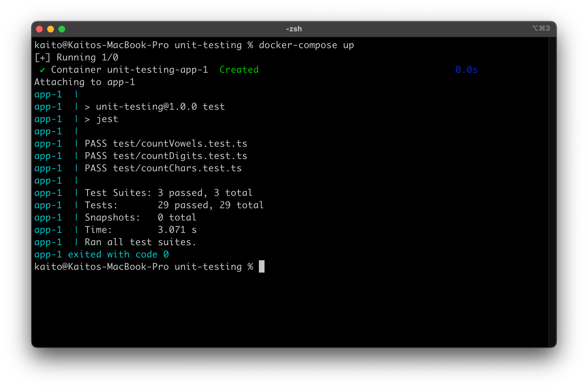
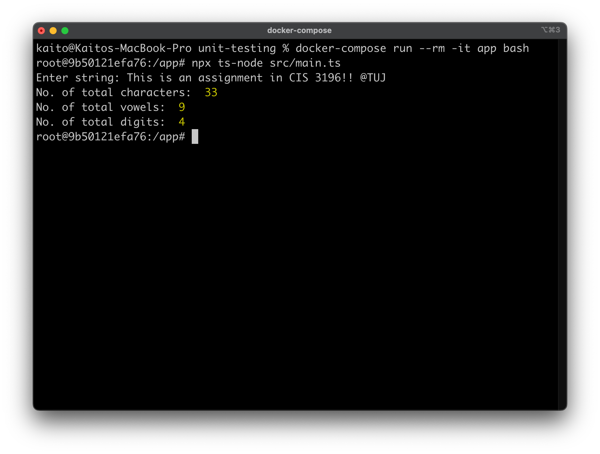

# CIS 3296 Unit Testing Assignment

This is an assignment for CIS 3296.
This assignment is to create a program that performs the following tasks:

- Accepts a string as input
- Prints the following statistics:
  - The total number of characters excluding spaces
  - The total number of vowels (a, e, i, o, u)
  - The total number of digits (0-9)

I chose to use **TypeScript** for the language and **Jest** for the testing framework.

# Prerequisites

To run this program, you need to have Docker and Docker Compose installed on your machine.

- Docker
- Docker Compose

If you already have Docker & Docker Compose on your machine, you can skip this section below.

## For Mac

Go to https://docs.docker.com/desktop/install/mac-install/ and install **Docker Desktop**.

## For Windows

Go to https://docs.docker.com/desktop/install/windows-install/ and install **Docker Desktop**.

If you face an error saying "WSL 2 installation is incomplete", then you have to install the kernel update and restart your machine. 

## For Linux

If you are on Ubuntu, go to https://docs.docker.com/desktop/install/linux/ubuntu/ and install **Docker Desktop**.

There are some instructions for other Linux distributions, so please follow the instructions on the website to install **Docker** and **Docker Compose**.

# Check if you successfully installed

Run the following command to check the version of Docker & Docker Compose.

```
docker --version
docker-compose --version
```

If you could not use the command `docker-compose --version`, then this might work.

```
docker compose --version
```

# How to run the program

## 1. Clone this repository

```
git clone https://github.com/ktsu2i/unit-testing.git
```

## 2. Run the test codes

Go to the cloned repository and run the Docker Compose.

```
cd unit-testing
docker-compose up --build
```

For the first time to run the program, it might take time to finish building the Docker image.
After you build the Docker image, you can also run the program with the following command.

```
docker-compose up
```

## 3. See the result

Once you run the program, the docker container automatically ends, but you can still see the result on your CLI like this.



As you can see above, the program ran successfully and passed all the tests.

## 4. How to run the main program

Run the following command to go inside the container.

```
docker-compose run -it app bash
```

Then, run the following command to run `main.ts`.

```
npx ts-node src/main.ts
```

You will be asked `Enter string: ` so that you can input string and see the result.



To exit the container, just type `exit`.

```
exit
```

## 5. How to clean up

You may want to clean up the Docker container and Docker image after you finish the program.

Run the following command to delete the Docker container.

```
docker-compose down
```
